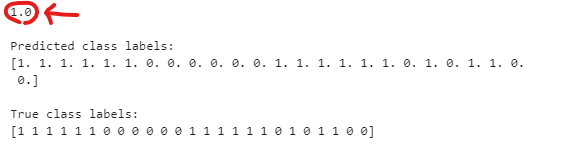

## Plagiarism Detector

### Project Overview
In this project, you will be tasked with building a plagiarism detector that examines a text file and performs binary classification; labeling that file as either plagiarized or not, depending on how similar the text file is to a provided source text.

### Getting the Project Materials
Since this project uses SageMaker, it is suggested that you create a new SageMaker notebook instance using your AWS console and link it to the [Github repository](https://github.com/udacity/ML_SageMaker_Studies.)
The project files are in the Project_Plagiarism_Detection directory

### Prediction results
The resulting accuracy obtained was the following

### Author:
Andrew Kalil

### Socials:
[Github](https://github.com/AndrewKalil)
[LinkedIn](https://www.linkedin.com/in/andrewkalil/)