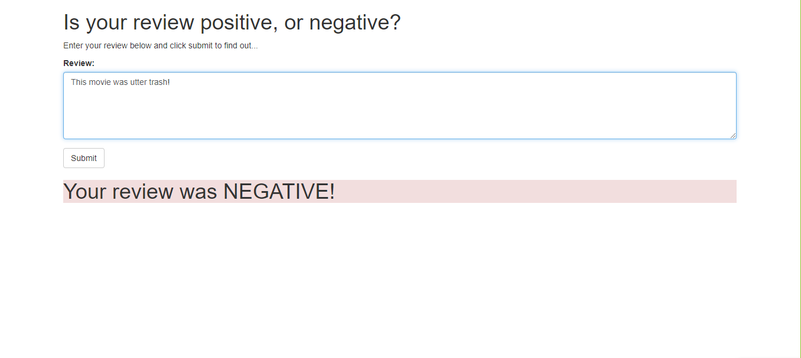

# Deploy a sentiment analysis model

## Objective
[Sentiment Analysis Web App](https://github.com/udacity/sagemaker-deployment/tree/master/Project) is a notebook and collection of Python files to be completed. The result is a deployed RNN performing sentiment analysis on movie reviews complete with publicly accessible API and a simple web page which interacts with the deployed endpoint.

 

## Structure

 

 

The above diagram depicts the different processes that go on in the background will. On the far right is the model that was trained and tuned in **SageMaker**. On the far left is the web application receives an user's movie review, submits it, and awaits for ``positive`` or ``negative`` sentiment in return.

It is important to mention that the **Lambda** function was built, so that it can execute a specific event, and the method to execute this function is a new *endpoint* that was created using **API Gateway**. This endpoint will be a URL that will listen for data to be sent to it. Once it gets some data, it will pass that data to the Lambda function and then return whatever the Lambda function returns. In other words, it will act as an interface that allows our web application to communicate with the Lambda function.

 

## Demo

The following show the web app working. Where I sent a negative comment about a movie and received a predicted sentiment:

 

## Author
- [Andrew Kalil](https://github.com/AndrewKalil)
